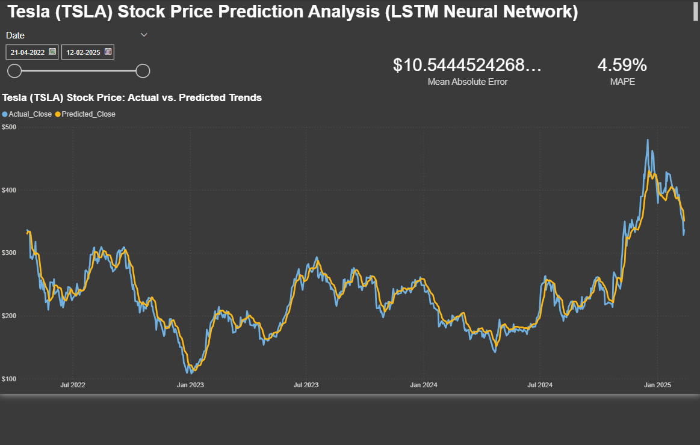

# 📈 Tesla Stock Price Forecasting: LSTM Neural Network & Power BI Dashboard

## 📌 Project Overview
This project establishes a high-performance machine learning pipeline to forecast the daily closing prices of Tesla (TSLA) stock. Leveraging a stacked **Long Short-Term Memory (LSTM)** neural network, the model captures complex, non-linear temporal dependencies in historical market data. The final output is integrated into a dynamic **Power BI dashboard**, providing a professional-grade interface for evaluating model accuracy and market trends.

## 🎯 Business Problem
Stock price prediction, especially for volatile assets like Tesla, is a significant challenge in quantitative finance. Traditional linear models often struggle with market shocks and non-stationary trends. The objective of this project was to develop a deep learning baseline that provides reliable, percentage-based error margins (MAPE), allowing analysts to understand the model's typical deviation from actual market movements.

## 🛠️ Tech Stack & Methodology
* **Data Engineering:** Python, Pandas, NumPy.
    * Chronological data splitting to eliminate look-ahead bias (data leakage).
    * MinMax Scaling fitted exclusively on training data.
    * 30-day sliding window sequence generation.
* **Deep Learning:** TensorFlow/Keras.
    * **Stacked LSTM Architecture:** Two layers (64 & 32 units) to learn hierarchical temporal patterns.
    * **Overfitting Protection:** Dropout layers (0.2) and **Early Stopping** based on validation loss.
* **Business Intelligence:** Power BI (DAX, Interactive Visualization).

## 📊 Model Evaluation & Results
The model was tested on unseen data, achieving results that demonstrate an exceptionally strong capability to follow general stock momentum:

* **Mean Absolute Percentage Error (MAPE): 4.59%** * *Business Impact:* On average, the model's predictions are within a tight ~4.6% of the actual closing price, providing a highly reliable baseline for daily trend analysis.
* **Mean Absolute Error (MAE): $10.54**
* **Root Mean Squared Error (RMSE): $14.06**
  * *Insight:* The higher RMSE compared to MAE reflects the model's expected sensitivity to sudden, extreme market volatility—a common characteristic of Tesla's stock profile.

## 🖥️ Interactive Power BI Dashboard
To bridge the gap between technical data science and business decision-making, the model results were modeled in Power BI. 

**Key Features:**
* **Dynamic KPI Cards:** Real-time tracking of MAE and MAPE.
* **Actual vs. Predicted Trend Line:** Visual alignment of model forecasts against market reality.
* **Date Slicer:** Ability to drill down into specific periods of high volatility.

## 📂 Project Structure
* `TSLA_Stock_Prediction_LSTM.ipynb`: Full Python implementation (Data Cleaning, EDA, LSTM Training, and Evaluation).
* `requirements.txt`: List of Python dependencies required to reproduce the environment.
* `TESLA_dataset.csv`: Historical raw data.
* `tesla_lstm_predictions.csv`: Model output used as the Power BI backend.
* `dashboard_preview.png`: Visualization of the final report.

## 💡 Key Learnings
* **Data Integrity:** Implemented a leak-proof time-series pipeline, ensuring the model never "saw" the future during training.
* **Business Translation:** Transformed raw Python performance metrics into interactive, stakeholder-ready BI visuals using DAX.
* **Architecture Optimization:** Utilized Early Stopping to ensure the model retained the best possible weights before any potential overfitting.

## ⚖️ License
This project is licensed under the MIT License - see the [LICENSE](LICENSE) file for details.
